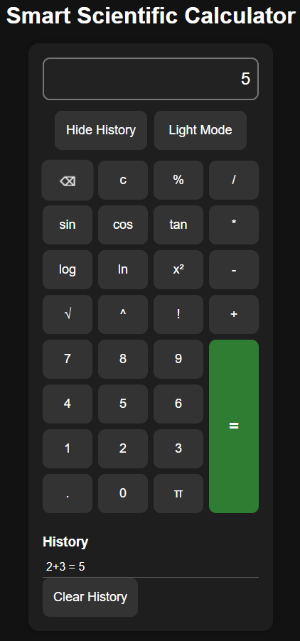

# Smart Scientific Calculator

A scientific calculator built using HTML, CSS and JavaScript.

## Features

- Basic arithmetic operations
- Scientific functions
- Keyboard support
- Dark/Light mode
- Calculation history
- Local storage persistence

## Technologies

- HTML
- CSS
- JavaScript

## Screenshot

## Features

- Scientific functions
- Dark Mode
- History
- Keyboard Support
- Local Storage

## Author

Aravind Thota
